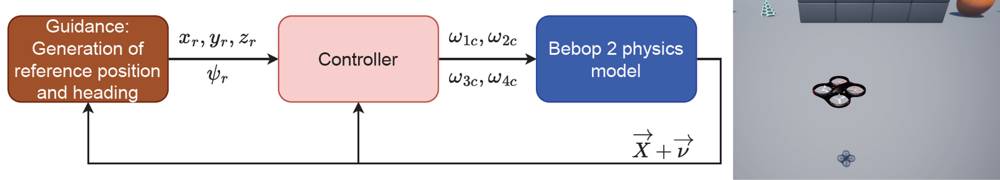

# Fault Detection and Diagnosis AirSim C++ plugin

This work provides the modified C++ AirSim plugin for the generation of drone sensor data under actuator faults using the AirSim simulator 
within Unreal Engine 4 (UE4) as proposed in the paper: "Unreal Success: Vision-Based UAV Fault Detection and Diagnosis Frame".
This entails the implementation of the UAV physics model, the force and moment BET correction model for actuator damage,
the INDI controller and the scoping tool that allows the
user to visualize signals when requesting them from the Python API. This Python API can be found in
the author's repo called [DataGatheringUE4](https://github.com/joigalcar3/DataGatheringUE4).

The repository contains C++ code for:
- the update of the vehicle states using the gray-box model from [Sihao Sun](https://arc.aiaa.org/doi/10.2514/1.C035135)
- the BET model that provides the force and moment corrections due to actuator damage
- the controller whose output drives the rotational speed of the propellers
- the functions that enable signal scoping, connecting the Python API with UE4

## Motivation
Gathering large quantities of data for knowledge-based fault detection models with an UAV is very time consuming,
dangerous and expensive. A
suitable alternative is the simulation of the vehicle in a realistic environment, the storage of the sensor synthetic data for
model training and the transfer learning to the real world UAV. In previous literature, Gazebo has been the quadrotor simulation tool of choice by the research community leading
to simulators such as [RotorS](https://link.springer.com/chapter/10.1007/978-3-319-26054-9_23) and [Hector](https://link.springer.com/chapter/10.1007/978-3-662-44468-9_58).
Despite its high-fidelity physics engine, the output quality of its
visual cues is far from photo-realistic. In this regard, there has been an effort in developing high-fidelity simulators for
computer vision tasks in the last 10 years. Blender’s Game Engine was used for the development of simulators, such as
[MORSE](https://ieeexplore.ieee.org/document/5980252) from 2011 to 2016. However, Unity and Unreal Engine have become the new state-of-the-art.
Besides their photo-realism, these engines have the benefit of providing an online asset marketplace for the generation
of an infinite number of simulation environments.

Examples of photo-realistic simulators are [FlightGoggles](https://flightgoggles.mit.edu/) and [Flightmare](https://github.com/uzh-rpg/flightmare)
 developed in Unity, and [UnrealCV](https://unrealcv.org/#:~:text=UnrealCV%20is%20an%20open%20source,external%20program%2C%20such%20as%20Caffe.)
, [Sim4CV](https://link.springer.com/article/10.1007/s11263-018-1073-7) and [AirSim](https://link.springer.com/chapter/10.1007/978-3-319-67361-5_40) developed in Unreal Engine. 
AirSim was launched in 2017 by Microsoft as an
open-source simulator built on Unreal Engine 4 (UE4) for AI research. It is a modular framework that fosters the
simulation of autonomous drones and ground vehicles with realistic physics and visual cues. It also includes C++ and
Python APIs that allow the researcher to interact programmatically with the vehicle for the extraction of state and sensor
information, as well as for providing vehicle control inputs. In contrast with the other simulators, it has an adaptable
framework for the introduction of new vehicle models and it is well documented. Thanks to its modularity, later works
have been built on AirSim for specialised applications, such as the [AirSim Drone Racing Lab](https://arxiv.org/abs/2003.05654). Another promising
simulator is [Isaac Sim](https://developer.nvidia.com/isaac-sim) developed by NVIDIA for the development and deployment of artificial learning applied to
robotics in their Omniverse simulator environment. Unfortunately, its computational requirements are beyond the
specifications of most commercially available workstations.

Given the advantages mentioned above, AirSim was the simulator of choice for the generation of synthetic data
for the training of a knowledge-based model capable of performing UAV actuator fault detection and diagnosis.
This work presents the C++ code of UUFOSim (Unreal UAV Failure injectiOn Simulator), a data gathering pipeline
built on AirSim for the collection of synthetic flight data with actuator failures in a urban environment, as
presented in the paper titled "Unreal Success: Vision-Based UAV Fault Detection and Diagnosis Frame".

## Code structure
Most of the files are the same as the original AirSim library. Here are the files that have suffered
the most important changes:

* *Airlib/include/physics/FastPhysicsEngine.hpp*: Provides the physics model of the vehicle, translating
the propeller rotational speed into forces and moments, and then to linear and angular accelerations,
velocities and pose (position and attitude) through the equations of motion and kinematic equations. The
gray-box aerodynamic model developed by [Sihao Sun](https://arc.aiaa.org/doi/10.2514/1.C035135) was used.

* *Airlib/include/physics/DamagedPropeller.hpp*: Provides all the information related to the propeller assembly as a whole and contains a list with all the
Blade objects that define the Propeller. It is used for calling methods applicable to all the blades which are required
for the computation of the Propeller center of gravity, as well as the moments and forces generated by the Propeller. 

* *Airlib/include/physics/DamagedBlade.hpp*: Provides all the information related to a single blade and contains a list with all the BladeSection objects that
define the Blade. It is used for calling methods applicable to all the BladeSections which are required for the
computation of the Blade center of gravity, blade area and mass, as well as the moments and forces generated by the
Blade.

* *Airlib/include/physics/DamagedBladeSection.hpp*:  Provides the class for the aerodynamic model identification and computation of forces and moments.
It holds all the information related to a single blade element according to BET theory. It is used for the
computation of the angle of attack and velocity seen by each BladeSection. Additionally, it computes the contribution
of the BladeSection lift and drag to the thrust force and torque.

* *Airlib/include/vehicles/multirotor/firmwares/simple_flight/SimpleFlightApi.hpp*: Provides the controller of the vehicle. The original default code would provide a PID controller. However, all the 
functions were added for an Incremental Nonlinear Dynamic Inversion controller (INDI) that is triggered when the method
called "getPWMrotors_INDI" is called. This controller was also replicated from [Sihao Sun](https://ieeexplore.ieee.org/document/9160894).
Additionally, the SimpleFlightApi contains all the functions that allow the scoping
of simulation signals. This means that one can request from the Python API to store a certain signal from a pool of options
in order to plot it or for debugging purposes. Examples of signals are the propeller rotational speeds, the vehicle position,
velocity or acceleration, or the forces created by the propeller damage. 

* *Airlib/include/vehicles/multirotor/firmwares/MultiRotorParams.hpp*: Provides the multirotor parameters of the Bebop 2.

## Implementation, results and conclusions
The results of this work can be found in the author's Master thesis and paper:

1. Master thesis: "From Data to Prediction: Vision-Based UAV Fault Detection and Diagnosis". Chapters 8.3-8.6.
2. Paper: "Unreal Success: Vision-Based UAV Fault Detection and Diagnosis Frame". Section III.C, Section III.D
and section V.A.. 

These documents explain:
* Drone guidance of AirSim
* Drone controller
* Gray-box physics model
* Data collection, failure injection and flight termination
* Flight & failure metadata logging and sensor data storage
* Clockspeed selection
* Debugging tool based on signal scoping
* Dataset specifications

## Installation steps
Please, follow the instructions found in the author's repo called 
[DataGatheringUE4](https://github.com/joigalcar3/DataGatheringUE4).

## Contact
Hope you enjoy the code!! For any questions, comments or suggestions, 
please reach out to me at [jose.dealvearcardenas@sjsu.edu](jose.dealvearcardenas@sjsu.edu). Also, 
please consider citing our research work below when using this repository.

    @inbook{deAlvearCardenasFDD2024,
        author = {José Ignacio de Alvear Cárdenas  and Coen C. de Visser},
        title = {Unreal Success: Vision-Based UAV Fault Detection and Diagnosis Framework},
        booktitle = {AIAA SCITECH 2024 Forum},
        chapter = {},
        pages = {},
        doi = {10.2514/6.2024-0760},
        URL = {https://arc.aiaa.org/doi/abs/10.2514/6.2024-0760},
    }
